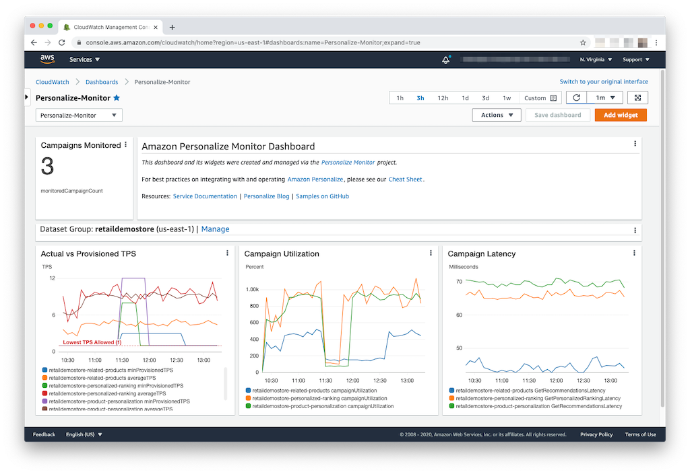

# Amazon Personalize Monitor - CloudWatch Dashboard Create/Update/Delete Function

The [dashboard_mgmt.py](./dashboard_mgmt.py) Lambda function is responsible for creating, updating/refreshing, and deleting the [CloudWatch dashboard](https://docs.aws.amazon.com/AmazonCloudWatch/latest/monitoring/CloudWatch_Dashboards.html) for this application. It is called in the following contexts:

- As part of the CloudFormation deployment process for this application as a [custom resource](https://docs.aws.amazon.com/AWSCloudFormation/latest/UserGuide/template-custom-resources.html) (create, update, delete).
- In response to the `BuildPersonalizeMonitorDashboard` CloudWatch event being handled. This event is published to the default [Amazon EventBridge](https://docs.aws.amazon.com/eventbridge/latest/userguide/what-is-amazon-eventbridge.html) event bus when a monitored campaign is automatically deleted so that the dashboard can be rebuilt. An EventBridge rule is used to trigger this function to be invoked when the event is received.
- At the top of every hour, triggered by a scheduled CloudWatch event. This ensures that any campaigns that are created or deleted (outside of this application) that meet the monitoring criteria are added to the dashboard.

 The dashboard will include line graph widgets for Actual vs Provisioned TPS, Campaign Utilization, and Campaign Latency for the Personalize campaigns you wish to monitor. Here is an example of a dashboard.



## How it works

The EventBridge event structure that triggers this function looks something like this:

```javascript
{
    "source": "personalize.monitor",
    "detail-type": "BuildPersonalizeMonitorDashboard",
    "resources": [ CAMPAIGN_ARN_THAT_TRIGGERED ],
    "detail": {
        "Reason": DESCRIPTIVE_REASON_FOR_UPDATE
    }
}
```

This function can also be invoked directly as part of your own operational process. The `Reason` is optional and just used for logging. 

```javascript
{
    "Reason": DESCRIPTIVE_REASON_FOR_UPDATE
}
```

### Create/Update

When called as part of this application's create or update deployment process or as a result of the `BuildPersonalizeMonitorDashboard`, the function first determines what Personalize campaigns should be monitored based on the CloudFormation template parameters you specify when you [installed](../README.md#installing-the-application) the application. The monitored campaigns are grouped by [dataset group](https://docs.aws.amazon.com/personalize/latest/dg/data-prep-ds-group.html) and placed in a dictionary that is passed to the python [chevron](https://github.com/noahmorrison/chevron) library to render the [dashboard template](./dashboard-template.mustache) file. The template uses the [mustache templating language](http://mustache.github.io/) to build the widgets.

Once the template is rendered as dashboard source (JSON), the dashboard source is used to create or update the CloudWatch dashboard by calling the [PutDashboard API](https://docs.aws.amazon.com/AmazonCloudWatch/latest/APIReference/API_PutDashboard.html).

Therefore, if you want to change what campaigns are monitored, just re-deploy this application and the current dashboard will be overwritten with your campaign changes or wait for the dashboard to automatically update itself (subject to campaign monitoring configuration). **This also means that any manual changes you make to the Personalize Monitor dashboard will be lost.** If you want to add your own widgets to the dashboard or change the existing widgets, you can fork this repository, change the [dashboard-template.mustache](./dashboard-template.mustache) template file, and deploy into your AWS account.

### Delete

When the CloudFormation stack is deleted for this application, this function will delete the dashboard.

## Calling from your own code

You can trigger the CloudWatch dashboard to be rebuilt by publishing the `BuildPersonalizeMonitorDashboard` detail-type from own code. Here is an example in python.

```python
import boto3
import json

event_bridge = boto3.client('events')

event_bridge.put_events(
    Entries=[
        {
            'Source': 'personalize.monitor',
            'DetailType': 'BuildPersonalizeMonitorDashboard',
            'Detail': json.dumps({
                'Reason': 'Rebuild the dashboard because I said so'
            })
        }
    ]
)
```